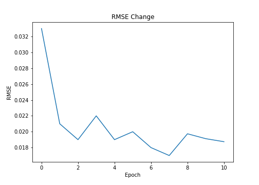
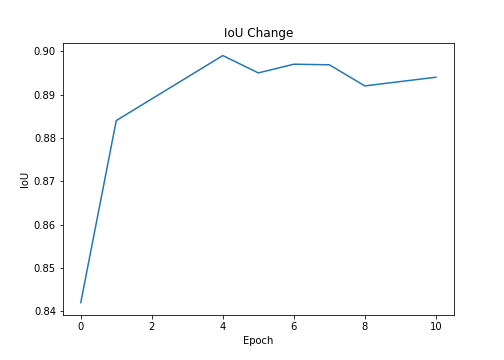
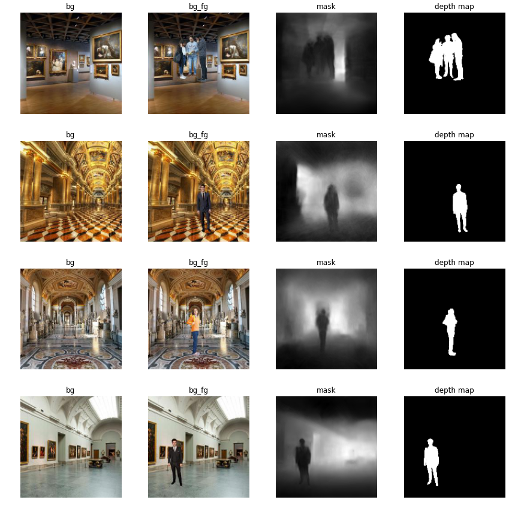
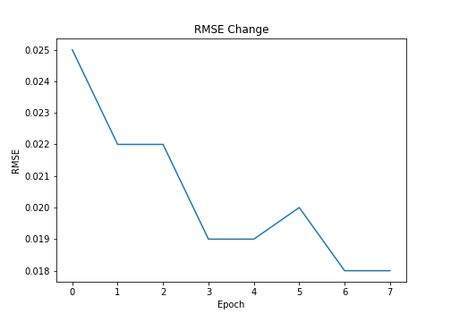
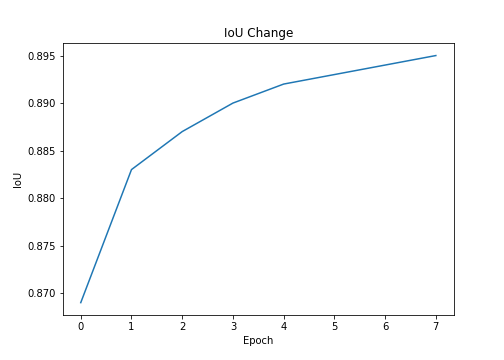
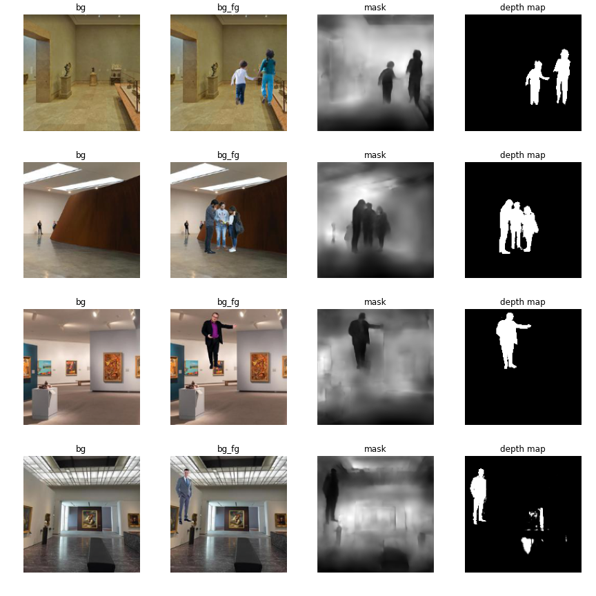
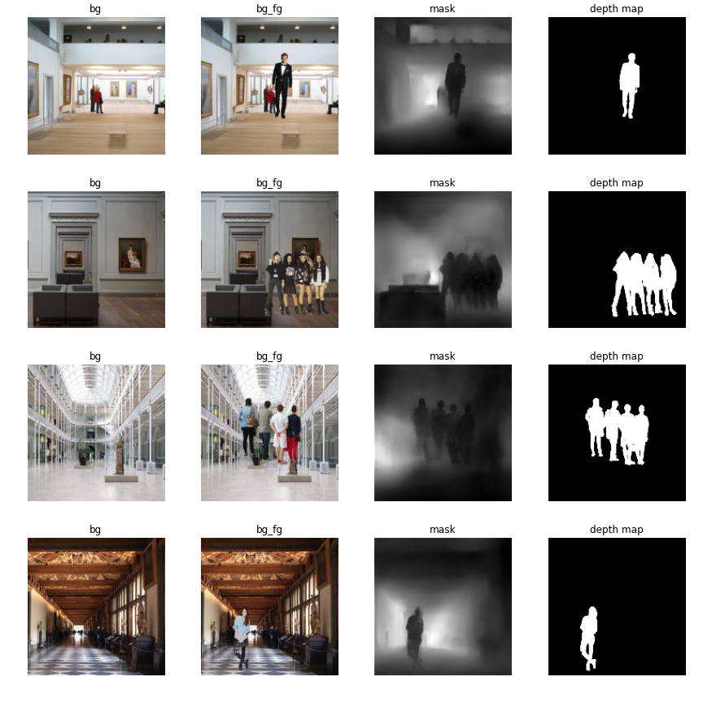

# Sesson 15 - Image Segmentation and Depth Estimation

## Assignment:
- Assignment description is already shared in the last assignment:
- Given an image with foreground objects and background image, predict the depth map as well as a mask for the foreground object. 
- It is an open problem and you can solve it any way you want. 
- Let's look at how it can be approached through some examples. 
- Assignment 14 (15A )was given to start preparing you for assignment 15th. 14th (15A) automatically becomes critical to work on the 15th. 
- The 15th assignment is NOT a group assignment. You are supposed to submit it along. 
- This assignment is worth 10,000 points. 
- Assignment 15th is THE qualifying assignment. 

## Solution:
### Objective:
- Given an image with foreground objects and background image, predict the depth map as well as a mask for the foreground object.
### Basics:
- Two major problems constantly solved in computer vision are:
	- Image Segmentation: In Image Segmentation, the machine has to partition the image into different segments, each of them representing a different entity.
	- Depth Estimation: In Depth Estimation, the machine has to extract the depth information of the foreground entities from a single image. 
### The Dataset:
- A custom dataset will be used to train this model, which consists of:
  - 100 background images
  

  - 100 foreground images
  

  - 100 foreground mask images
  

  - 400k foreground overlayed on background images
  

  - 400k masks for the foreground overlayed on background images
  

  - 400k depth maps for the foreground overlayed on background images
  

	
- Dataset Link: [click here to download](https://drive.google.com/file/d/1xN6ytCpX_KTmP8U1hz-JpSHhNdBlqJ12/view?usp=sharing)
- Dataset Creation: [click here to see](https://github.com/aswa09/EVA-4/tree/master/S14)
- Notations
	- Background image: **bg**
	- Foregroung overlayed on background: **fg_bg**
	- Mask for fg_bg: **fg_bg_mask**
	- Depth map for fg_bg: **fg_bg_depth**

### Model Architecture
- The inputs and the outputs are of same resolution and thus the model has an encoder-decoder architecture, where the model takes two inputs: BG and BG-FG and returns two outputs: Depth Map and Mask. The inputs are first individually processed through two encoder blocks each, which in turn reduces their size to 56x56, given the input shapes are 224x224. The reason for processing the two inputs separately for two encoder blocks is that:

- The output of these encoder blocks will be later fed as a skip connection to the last layers of the model, this might help the model in making better predictions as this way, the model will have the chance to see the two inputs separately in its last layers which may enhance its performance to identify the differences between the two inputs which is required to predict the mask and depth of the foreground object.

- An image of size 56x56 is sufficient for a convolutional model to extract information out of it. Thus we can apply two encoder blocks on the images separately before sending them to the network and not worry about losing information.
After encoding the inputs, they are merged together and sent through a series of encoder blocks until the image size becomes 7x7x512 (again a reminder, all these calculations are based on the fact that the input given to the model is 224x224).

- After the encoding has been done, the encoded input is passed through two separate decoder networks which are responsible for predicting the depth map and the mask respectively. This encoder-decoder architecture is based on the famous convolutional neural network UNet. The model architecutre can be seen below

	

- The model has 10,343,490 parameters. Each of the encoder and decoder blocks are based on a ResNet block. The detailed diagram explaining the flow of each block can be seen below

	

	
#### Parameters Count
		================================================================
		Total params: 10,343,490
		Trainable params: 10,343,490
		Non-trainable params: 0
		----------------------------------------------------------------
		Input size (MB): 86436.00
		Forward/backward pass size (MB): 3193797.28
		Params size (MB): 39.46
		Estimated Total Size (MB): 3280272.75
		----------------------------------------------------------------

### Image Augmentation
- The input images (background and background-foreground) were normalized according to the values given on the dataset page.
- No preprocessing was done on the output images except converting them into torch.Tensor type and keeping their values within the range [0, 1].
- There was no point in applying any physical data augmentation techniques on the images as it would distort them from their corresponding labels which were not augmented.
- So, the only option left was to use photometric augmentations.
- `HueSaturationValue` and `RandomContrast` augmentations from the `albumentations` package. The code for augmentation can be seen [here](./all_utils/data/processing.py).

### Training
Each experiment described below had the following common traits

- The model was trained on smaller resolution images first and then gradually the image resolution was increased.
- **IoU** and **RMSE** were used as evaluation metrics. IoU was calculated on mask outputs while rmse was calculated on depth outputs.
- TensorBoard integration which generated model output after every epoch to keep track of model progress.
- Reduce LR on Plateau with patience of 2 and min lr of 1e-6.
- Auto model checkpointing which saved the model weights after every epoch.
- Each model was trained in small sets of epochs, this was done to ensure that the model training does not suffer from sudden disconnection from Google Colab.

The code used for training the model can be found [here](./all_utils/engine/learner.py). The `Learner` class present in this file was inherited by the file [here](./learner.py) to adapt for the changes in the depth-segmentation model.

## RMSE + (BCE & Dice)
This experiment had the following features:
- Data Augmentation
  - Hue Saturation Value
  - Random Contrast
- Image resolution change during training
  - First 3 epochs: 96x96
  - Epoch 4-8: 160x160
  - Epoch 9-11: 224x224
  
### Results

|                       RMSE                       |                      IoU                       |
| :----------------------------------------------: | :--------------------------------------------: |
|  |  |

### Predictions

## SSIM + Dice
This experiment had the following features:
- Data Augmentation
  - Hue Saturation Value
  - Random Contrast
- Image resolution change during training
  - First 3 epochs: 96x96
  - Epoch 4-8: 160x160

### Results

|                     RMSE                     |                    IoU                     |
| :------------------------------------------: | :----------------------------------------: |
|      |      |

### Predictions

## LR Range Test

Neither of the experiments above gave very good results, so I thought of performing the LR Range Test in order to find the best initial learning rate for the model and then train the model again. The LR Range test was perfomed 5 times and I got the following results

| Start LR | End LR | Iterations |  Loss  | Learning Rate |
| :------: | :----: | :--------: | :----: | :-----------: |
|   1e-7   |   5    |    400     | 0.3917 |    0.2805     |
|   1e-5   |   1    |    400     | 0.2976 |    0.1090     |
|   1e-4   |   10   |    200     | 0.3653 |    0.4467     |
|   1e-5   |   2    |    100     | 0.8588 |    0.2511     |
|   1e-7   |   10   |    400     | 0.3179 |    0.2884     |

The least loss was obtained when learning rate was ~ `0.1`. I choose the initial learning rate 0.1 for my next experiment.

## RMSE + (BCE & Dice) with New LR and No Augmentation
This experiment had the following features:

- Initial Learning Rate: 0.1
- Learning Rate is manually reduced by 10 after 3 epochs.
- Image resolution change during training
  - First 3 epochs: 96x96
  - Epoch 4-6: 160x160
- This models reaches an IoU for 0.92 and RMSE of 0.014 which makes it the best of the models tested above.

### Results

|                  RMSE                  |                 IoU                  |
| :------------------------------------: | :----------------------------------: |
|  |  |

### Predictions

So from the predictions, we can say that the **RMSE + (BCE & Dice)** Loss without any augmentation and a proper initial LR seems to be the best loss function suitable for this task.
